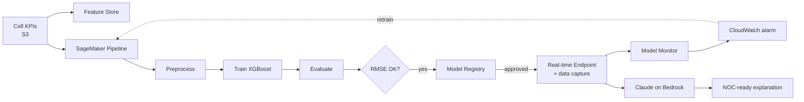

# SageMaker + Bedrock: GenAI MLOps for Telecom Network Performance

[](https://github.com/ayman-metwally2020/sagemaker-bedrock-genai-mlops-demo/actions/workflows/ci.yml)


An end-to-end, production-style reference for taking an ML model from raw data to a monitored endpoint on AWS, then using **Claude on Amazon Bedrock** to turn each prediction into a plain-language explanation that a network operations engineer can act on.

**Use case:** predict downlink throughput per cell from radio KPIs (PRB utilisation, active users, RSRP, SINR, handover failures), flag degraded cells, and explain *why* in plain English.



## What's inside

| Folder | What it does | Key AWS service |
|---|---|---|
| [`data/`](data/) | Synthetic telecom KPI generator (no real customer data) | — |
| [`feature_store/`](feature_store/) | Creates an online + offline feature group and ingests KPIs | SageMaker Feature Store |
| [`pipelines/`](pipelines/) | Preprocess → Train → Evaluate → conditional Register; deploy script | SageMaker Pipelines, Model Registry, Endpoints |
| [`training/`](training/) | Algorithm choice and hyperparameter notes | SageMaker Training |
| [`monitoring/`](monitoring/) | Baseline, hourly data-quality schedule, drift alarm | Model Monitor, CloudWatch |
| [`bedrock_genai/`](bedrock_genai/) | Explains a prediction for NOC engineers | Amazon Bedrock (Claude) |
| [`architecture/`](architecture/) | Architecture and design decisions | — |
| [`tests/`](tests/) | Offline unit tests, run in CI | — |

## Quick start

### 1. Run locally (no AWS account needed)

```bash
pip install -r requirements-dev.txt
python data/generate_data.py --rows 20000 --out data/telecom_kpis.csv
pytest -q
```

### 2. Run on AWS

You need an IAM role SageMaker can assume (`AmazonSageMakerFullAccess` plus S3 access) and Bedrock model access for Claude in your region.

```bash
pip install -r requirements.txt
export ROLE=arn:aws:iam::<account-id>:role/<SageMakerExecutionRole>
export BUCKET=<your-bucket>

# Upload data
aws s3 cp data/telecom_kpis.csv s3://$BUCKET/telecom/raw/

# Optional: feature store
python feature_store/create_feature_group.py --role-arn $ROLE --csv data/telecom_kpis.csv

# Build, register and run the pipeline
python pipelines/pipeline.py --role-arn $ROLE --bucket $BUCKET --upsert --start

# Approve the model in SageMaker Studio (Model Registry), then deploy
python pipelines/deploy.py --role-arn $ROLE --endpoint-name telecom-throughput

# Monitoring and drift alarm (baseline CSV must include a header row)
python monitoring/setup_monitoring.py --role-arn $ROLE --endpoint-name telecom-throughput \
    --baseline-csv s3://$BUCKET/telecom/raw/telecom_kpis.csv

# Explain a prediction with Claude on Bedrock
python bedrock_genai/explain_prediction.py --endpoint-name telecom-throughput \
    --kpis '{"prb_utilization": 92, "active_users": 180, "rsrp_dbm": -112, "sinr_db": 2.5, "handover_failure_rate": 0.06, "hour_of_day": 20}'
```

> **Cost note:** endpoints and monitoring schedules bill while they run. Delete the endpoint and schedule when you're done.

## Example output

```text
Predicted throughput: 38.4 Mbps

- Status: degraded (between 30 and 80 Mbps).
- Main drivers: very low SINR (2.5 dB) and weak coverage (RSRP -112 dBm),
  plus heavy busy-hour load (92% PRB, 180 users).
- Next checks: look for interference sources or a tilt change on this sector;
  consider load balancing to a neighbour cell during 19:00-22:00.
```

*(Illustrative; the exact wording varies between runs.)*

## Design decisions

- **XGBoost built-in container**: a strong baseline for tabular KPIs; no custom image to maintain.
- **Conditional registration**: a model is only registered if test RMSE is under a pipeline parameter, and still needs **manual approval** before deployment.
- **Drift → retrain loop**: Model Monitor publishes CloudWatch metrics; the alarm can trigger an EventBridge rule that starts the pipeline.
- **GenAI on top, not instead**: the numeric model makes the prediction; Claude only explains it, and is told never to invent KPIs.

See [`lessons_learned.md`](lessons_learned.md) for what I'd do differently in production.

## Further reading

- [Automate model retraining with SageMaker Pipelines when drift is detected](https://aws.amazon.com/blogs/machine-learning/automate-model-retraining-with-amazon-sagemaker-pipelines-when-drift-is-detected/)
- [How Swisscom built a network assistant using Amazon Bedrock](https://aws.amazon.com/blogs/machine-learning/transforming-network-operations-with-ai-how-swisscom-built-a-network-assistant-using-amazon-bedrock/)
- [aws-samples: MLOps with Feature Store and Data Wrangler](https://github.com/aws-samples/amazon-sagemaker-mlops-with-featurestore-and-datawrangler)

## Author

**Ayman Metwally**: cloud, data and GenAI practitioner focused on telecom analytics and MLOps.
If this repo helped you, please ⭐ it, and feel free to open an issue or PR.

Licensed under [MIT](LICENSE).
