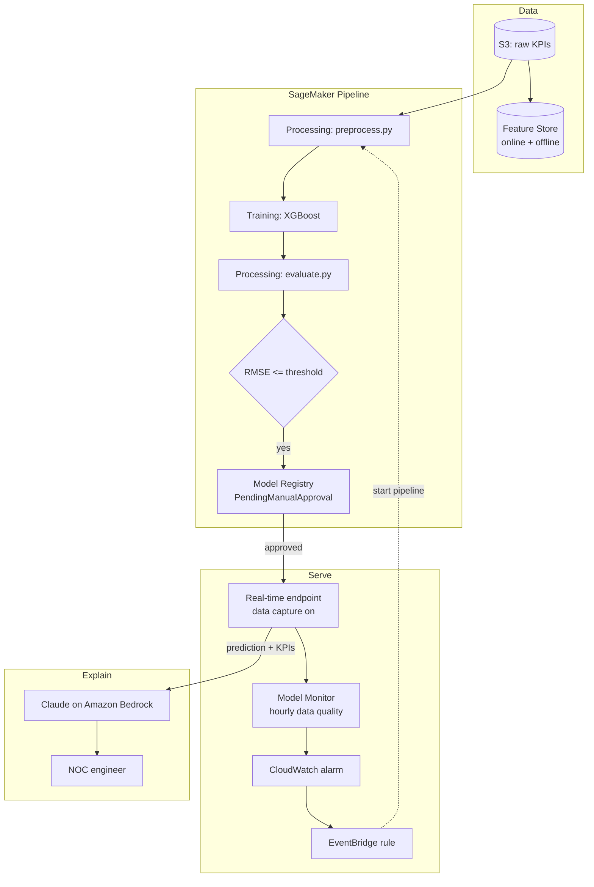

## Architecture

### Flow

1. **Ingest**: raw hourly cell KPIs land in S3 and are optionally written to Feature Store, so training and inference use the same feature definitions.
2. **Build**: the pipeline cleans and splits data, trains XGBoost, evaluates on a held-out test set, and registers the model only if RMSE is acceptable.
3. **Approve and deploy**: a human approves the model package; `pipelines/deploy.py` deploys the latest approved version with data capture enabled.
4. **Monitor**: Model Monitor compares captured traffic against the training baseline every hour and publishes drift metrics to CloudWatch.
5. **Retrain**: a drift alarm can drive an EventBridge rule that restarts the pipeline.
6. **Explain**: each prediction plus its KPIs is sent to Claude on Bedrock, which returns a short status, likely drivers, and next actions.

### Security notes

- Use a least-privilege SageMaker execution role scoped to the project bucket.
- Keep endpoints in a VPC with private subnets for production; use VPC endpoints for S3, SageMaker and Bedrock.
- Encrypt S3, Feature Store and endpoint volumes with KMS.
